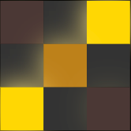

# Dotrix



A Flutter dot matrix animation indicator library with 28 beautiful effects.

## Features

- 🎯 **28 Built-in Animations**: Pulse, Spinner, Wave, ArrowMove, Burst, Chaos, Clockwise, Corners, Cross, Diamond, Pulse2, SineWave, Spiral, Zigzag, Radial, Cascade, Inward, Ripple, Checkerboard, Converge, Scatter, Flip, PulseRing, DiagonalRace, FlowUp, FlowDown, FlowLeft, FlowRight
- 🎨 **Fully Customizable**: Configure dot size, colors, spacing, glow effects, animation speed, and more
- 🔄 **Auto-playing**: All animations play automatically with infinite loops
- 📦 **Zero Dependencies**: Pure Flutter implementation, no external packages needed
- 💎 **Production Ready**: Well-tested, performant, and easy to integrate

## Getting Started

Add this to your package's `pubspec.yaml` file:

```yaml
dependencies:
  dotrix: ^1.0.0
```

## Usage

```dart
import 'package:dotrix/dotrix.dart';

// Basic usage
Pulse()

// With customization
Pulse(
  dotSize: 36,
  spacing: 4,
  activeColor: Color(0xFFFF14CC),
  shadowColor: Color(0xFFFFA3EB),
  blurRadius: 15,
  animationSpeed: Duration(milliseconds: 1550),
)

// Available indicators
// Basic
Pulse()      // Pulse effect from center
Spinner()    // Clockwise rotation
Wave()       // Diagonal wave propagation

// Extended
ArrowMove()  // Arrow path movement
Burst()      // Burst from center
Chaos()      // Random chaotic flashing
Clockwise()  // Clockwise click effect
Corners()    // Corner-to-corner diffusion
Cross()      // Cross-shaped diffusion
Diamond()    // Diamond pattern (corners+center flash, edges glow)
Pulse2()     // Alternative pulse rhythm
SineWave()   // Sine wave propagation

// Advanced
Spiral()         // Spiral animation
Zigzag()         // Zigzag pattern
Radial()         // Radial burst
Cascade()        // Cascading effect
Inward()         // Inward convergence
Ripple()         // Ripple effect
Checkerboard()   // Checkerboard pattern
Converge()       // Converging dots
Scatter()        // Scattering dots
Flip()           // Flipping animation
PulseRing()      // Pulse ring effect
DiagonalRace()   // Diagonal race

// Flow
FlowUp()      // Flow upward
FlowDown()    // Flow downward
FlowLeft()    // Flow leftward
FlowRight()   // Flow rightward
```

### Common Parameters

All indicators support these parameters:

| Parameter | Type | Default | Description |
|-----------|------|---------|-------------|
| `dotSize` | double | 8.0 | Size of each dot in pixels |
| `borderRadius` | double | 0.0 | Corner radius of dots |
| `spacing` | double | 0.0 | Gap between dots |
| `activeColor` | Color | theme primary | Color when active |
| `inactiveColor` | Color | theme surface | Color when inactive |
| `opacity` | double | 1.0 | Overall opacity (0.0-1.0) |
| `shadowColor` | Color | auto (from active) | Glow/shadow color |
| `shadowOffset` | Offset | (0, 0) | Shadow position offset |
| `blurRadius` | double | 10.0 | Shadow blur radius in pixels |
| `spreadRadius` | double | 0.0 | Shadow spread radius |
| `scale` | double | 1.1 | Scale ratio when active |
| `scaleAlignment` | Alignment | center | Scale alignment point |
| `animationSpeed` | Duration | varies | Duration of one animation cycle |

## License

MIT License - see [LICENSE](LICENSE) for details.

## Additional Information

For more examples, see the `/example` directory.

To contribute, please feel free to submit issues or pull requests at [GitHub](https://github.com/fluttercandies/dotrix).
